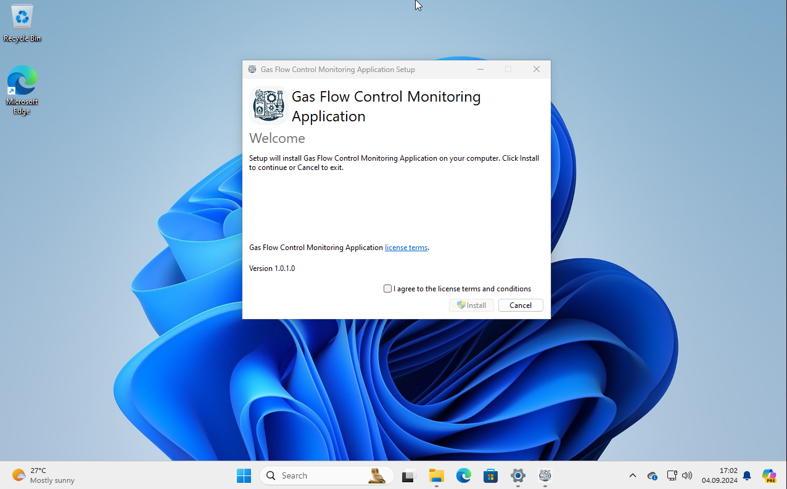

# Installer_GasFlowControl
This repository contains source code for Monitoring_GasFlowControl



# Mastering WiX Toolset v5: Cheatsheet for building your installer in gihub actions
## Introduction

Creating reliable and efficient installers is a crucial part of software development. With WiX Toolset v5, you can streamline this process and ensure your applications are installed correctly every time.
I started my journey with installers using InnoSetup, which served me well for a while. However, my first experience with WiX Toolset, back in version 3, was quite disappointing due to its complexity and lack of user-friendly features. Fast forward to WiX Toolset v5, and I was genuinely impressed by the significant improvements and new features. In this post, I’ll share a detailed guide on how to create installers and bootstrappers, complete with all necessary dependencies.

## Step-by-Step Guide

### Setting Up Your Environment Download and Install WiX Toolset v5:
First, head over to the WiX Toolset official website to download the latest version. Follow the installation instructions to get it up and running on your system.
(https://wixtoolset.org/docs/intro/)
There are some tips that are not present in the documentation, but it is still great enough to create basic installer.

**Do not afraid to read and use docs from version 3 of Wix. Often nothing changed from v3 to v4/5 in particular attribute or element.**
### Integrate with Visual Studio:
To make the most of WiX Toolset, integrate it with Visual Studio. You can do this by installing the WiX Toolset Visual Studio extension from the Visual Studio Marketplace.
### Using WiX Toolset Without Visual Studio:
**WiX Toolset v5 can also be used without Visual Studio, which can be beneficial for more experienced users or those who prefer a different development environment. However, for beginners, setting up Visual Studio with WiX extensions is recommended for ease of use.**

#### Steps to Use WiX Toolset Without Visual Studio:
1) Install .NET:
    
    Ensure you have MSBuild and .NET installed. You can download .NET from the [official .NET website](https://learn.microsoft.com/en-us/dotnet/core/tools/global-tools).
    Or install MSBuild using the actions:
    ```yaml
    - name: Add msbuild to PATH
        uses: microsoft/setup-msbuild@v2
    ```

2) Install WiX Toolset:
Run the following command to install WiX Toolset globally:
    ```shell
    dotnet tool install --global wix
    ```
3) Add Necessary Extensions:
If your installer uses extensions, add them using these commands (you could find their names on this page https://wixtoolset.org/docs/tools/wixext/):
    ```shell
    wix extension add --global WixToolset.VisualStudio.wixext
    wix extension add --global WixToolset.BootstrapperApplications.wixext
    wix extension add --global WixToolset.Util.wixext
    ```
4) Build the Installer:
To build the installer, use the following commands:
    ```shell
    wix build -ext WixToolset.VisualStudio.wixext .\Package.wxs .\Folders.wxs .\Package.en-us.wxl .\MainComponents.wxs -arch x86 -out .\out\Setup_GasFlowControl_x86.msi
    ``` 
   for installing in the Program Files (x86), or
    ```shell
    wix build -ext WixToolset.VisualStudio.wixext .\Package.wxs .\Folders.wxs .\Package.en-us.wxl .\MainComponents.wxs -arch x64 -out .\out\Setup_GasFlowControl_x64.msi
    ```
    if the installation should be in the Program Files.

5) Upload artifact:
    ```yaml
    - name: Upload a Build Artifact
        uses: actions/upload-artifact@v4.3.6
        with:
          # Artifact name
          name: "GasFlowControl-artifact"
          # A file, directory or wildcard pattern that describes what to upload
          path: D:\a\Installer_GasFlowControl\Installer_GasFlowControl\GasFlowControl\GasFlowControl\out\*.msi
          # The desired behavior if no files are found using the provided path.
          if-no-files-found: error # optional, default is warn
          # Duration after which artifact will expire in days. 0 means using default retention.
    ```

## Some bootstrapper tips
If you need to install any more dependencies to run your application, the best way to do this is to connect bootstrapper.
For example, I need to install VC_Redist.exe to launch my application.
Since Windows cannot run two installers at the same time, there is a problem with dependency installers. And here is the bundle comes in.


### Building the Bootstrap Application:
The structure of bundle with bootstrapper usually looks like this:
```xml
<Wix xmlns="http://wixtoolset.org/schemas/v4/wxs"
     xmlns:bal="http://wixtoolset.org/schemas/v4/wxs/bal">
  <Bundle>
    <BootstrapperApplication>
       <!-- some attributes and Some payloads  -->
    </BootstrapperApplication>
    <Chain>
       <!-- Check the https://wixtoolset.org/docs/schema/wxs/chain/ -->
       <MsiPackage SourceFile=""/>
    </Chain>
  </Bundle>
</Wix>
```

I chose to use the x86 architecture for the bootstrap application because it is compatible with both x64 and x86 systems:
```shell
wix build -arch x86 -ext WixToolset.BootstrapperApplications.wixext -ext WixToolset.Util.wixext -src .\bootstap.wxs -out Setup_GasFlowControl.exe
```
But in the bootstap.wxs you should add this install conditions:
```xml
<MsiPackage SourceFile="../GasFlowControl/GasFlowControl/out/Setup_GasFlowControl_x86.msi" CacheId="GasFlowControl_x86" InstallCondition="NOT VersionNT64" />
<!-- Install x64 package on 64-bit systems -->
<MsiPackage SourceFile="../GasFlowControl/GasFlowControl/out/Setup_GasFlowControl_x64.msi" CacheId="GasFlowControl_x64" InstallCondition="VersionNT64" />
```
This will let you install needed type of package for needed architecture.

### Some tips 
In 4-th and 5-th version of Wix the icon of the bootstrapper is not showing even if the attributes of <bundle> like  IconSourceFile or LogoFile are defined.
```xml
<Bundle
        Name="Gas Flow Control Monitoring Application"
        Version="1.0.1.0"
        Manufacturer="Oleg Sirenko"
        Copyright="© 2024 Oleg Sirenko"
        AboutUrl="https://github.com/OlegSirenko/Monitoring_GasFlowControl"
        UpgradeCode="dfc3a102-ad36-44ad-8327-92c0d56ae401"
        Condition="VersionNT &gt;= v6.1">
    <BootstrapperApplication>
        <bal:WixStandardBootstrapperApplication
                LicenseUrl="https://github.com/OlegSirenko/Monitoring_GasFlowControl/blob/main/LICENSE"
                ShowVersion="yes"
                SuppressOptionsUI="yes"
                Theme="hyperlinkLargeLicense"
                LogoFile="..\..\..\resources\new_icon.png"
        />
    </BootstrapperApplication>
    <!-- other bal: sections -->
</Bundle>
```
To enable icon you should download theme from the [wixtoolset](https://github.com/wixtoolset/wix/tree/v4.0.5/src/ext/Bal/wixstdba/Resources) repo and change this string like this:
```xml
<Window Width="500" Height="390" HexStyle="100a0000" FontId="0" Caption="#(loc.Caption)" IconFile="icon.ico">
```

After this you should add this lines:
`IconSourceFile="..\..\..\resources\icon_preporation\icon_64.ico">` in the `<Bundle>` section and `<Payload Name="icon.ico" SourceFile="..\..\..\resources\icon_preporation\icon_64.ico" Compressed="yes" />` in the `<BootstrapperApplication>`.

in the end it should look like this:
```xml
<Bundle
Name="Gas Flow Control Monitoring Application"
Version="1.0.1.0"
Manufacturer="Oleg Sirenko"
Copyright="© 2024 Oleg Sirenko"
AboutUrl="https://github.com/OlegSirenko/Monitoring_GasFlowControl"
UpgradeCode="dfc3a102-ad36-44ad-8327-92c0d56ae401"
Condition="VersionNT &gt;= v6.1"
IconSourceFile="..\..\..\resources\icon_preporation\icon_64.ico">

    <BootstrapperApplication>
      <bal:WixStandardBootstrapperApplication
        LicenseUrl="https://github.com/OlegSirenko/Monitoring_GasFlowControl/blob/main/LICENSE"
        ShowVersion="yes"
        SuppressOptionsUI="yes"
        Theme="hyperlinkLargeLicense"
        ThemeFile = ".\HyperlinkLargeTheme.xml"
        LogoFile="..\..\..\resources/new_icon.png"
        />

      <Payload Name="icon.ico" SourceFile="..\..\..\resources\icon_preporation\icon_64.ico" Compressed="yes" />
    </BootstrapperApplication>
    <!-- The rest of your bundle should be placed here -->
```